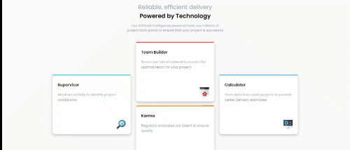

# Four card feature section HTML and CSS UI Component.

- Four feature card section UI component written in HTML and CSS
- This is a [frontend mentor](https://www.frontendmentor.io/) challenge.
- link to [original Challenge](https://www.frontendmentor.io/challenges/four-card-feature-section-weK1eFYK).

---

## Table of contents

- [General info](#General-info)
- [Built with](#Built-with)
- [Contributing](#Contributing)
- [License](#License)
- [Contact](#Contact)
- [Acknowledgement](#Acknowledgement)

---

## General info

### The challenge

- Build out this feature section and get it looking as close to the design as possible.
- It should be responsive.

### Where to find everything

- The designs, mobile and desktop version, can be found inside the `/design` folder.

- All the required assets (already optimized) are in the `/images` folder.

- There is also a [style-guide.md](./style-guide.md) file, which contains the information you'll need, such as color palette and fonts.

---

## Built with

- HTML
- CSS

---

## Contributing

Pull requests are welcome. For major changes, please open an issue first to discuss what you would like to change.

---

## Contact

You can reach out to me via:

- eckkoenterprise@gmail.com
